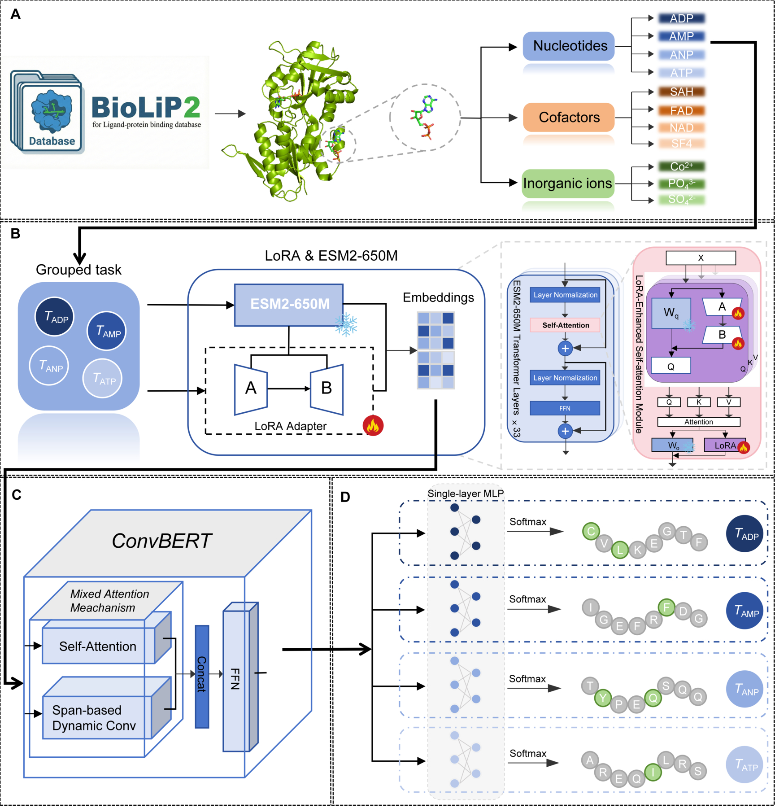

# **Symphony-Bind: Prediction of Protein-Small Molecule Binding Sites via Fine-Tuning Protein Language Models and Grouped Multi-Task Learning**

## **Symphony-Bind**

#### Symphony-Bind is a Grouped Multi-Task Learning （GMTL） framework that leverages LoRA-enhanced ESM2-650M to extract embeddings, which are subsequently refined by a shared ConvBERT module and then processed by small molecule-specific MLPs for precise binding site prediction. The overall workflow of Symphony-Bind is illustrated in the schematic diagram below.

#### 

#### Performance evaluation on 11 representative ligand tasks shows that Symphony-Bind achieves average MCC values of 0.561, 0.629, and 0.324 for the nucleotide, cofactor, and inorganic ion groups, surpassing other state-of-the-art methods.

## **Dependencies**

* #### Python Version: `3.10`
* #### Required Packages: See [requirements.txt](./requirements.txt) for a complete list of dependencies.

## **Usage**

* #### Train [train\_esm2\_t33\_MTL\_lora.sh](./scripts/train_esm2_t33_MTL_lora.sh)
* #### Predict [test\_esm2\_t33\_MTL\_lora.sh](./scripts/test_esm2_t33_MTL_lora.sh)
* #### The trained model can be found in [results](./results/)

## **Citation**

#### Please consider citing the work below if this repository is helpful:

